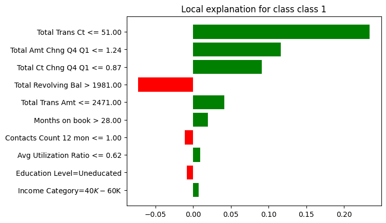

# XChurn - Credit Card Churn Detection with Explainable AI
The application is deployed on **Google Cloud Run** using Docker images from Docker Hub.  
Access the live application here:  

🔗 **[Credit Card Churn Prediction App](https://churn-api-frontend-1018442469746.europe-west1.run.app/)**  

This project builds a machine learning pipeline to predict customer churn based on credit card usage patterns. It includes model training, evaluation, and a deployed application with both FastAPI and Streamlit interfaces. The solution is fully containerized using Docker and deployable on **GCP Cloud Run** using Docker images from Docker Hub.

## Key Features

- **0.89 Macro F1 Score** on test data for churn prediction  
- **End-to-End ML Pipeline**: Data preprocessing, feature engineering, model training, and evaluation  
- **Streamlit Frontend**: Interactive UI for CSV file predictions  
- **FastAPI Backend**: Lightweight REST API for batch prediction  
- **Dockerized**: Easily portable and reproducible environments  
- **Deployed on GCP Cloud Run**: Live application hosted in the cloud  

## Tech Stack

- **Language**: Python  
- **ML Frameworks**: scikit-learn, pandas, numpy  
- **Web App**: Streamlit  
- **API**: FastAPI  
- **DevOps**: Docker, Docker Compose, Git, GCP Cloud Run  
- **Version Control**: Git & GitHub  

## Data Source

The dataset used for this project is publicly available on Kaggle:  
[Credit Card Bank Churn Dataset](https://www.kaggle.com/datasets/anwarsan/credit-card-bank-churn)

## How to Run Locally

1. Clone the repository:
   ```bash
   git clone https://github.com/Misty033/Credit_Card_Churn_Detection.git
   cd Credit_Card_Churn_Detection


2. Build and run with Docker Compose:
   ```bash
   docker compose up --build
   ```

## Access

- Streamlit app: [http://localhost:8501](http://localhost:8501)  
- FastAPI docs: [http://localhost:8000/docs](http://localhost:8000/docs)  

## Sample Input CSV

You can download the sample input file to test the application:  
[Download sample_input.csv](https://github.com/Misty033/Credit_Card_Churn_Detection/blob/main/file.csv)  
[Download sample_input.csv](https://github.com/Misty033/Credit_Card_Churn_Detection/blob/main/file2.csv)

## Model Explainability

.png)

## Authors

- Misty Roy  
- Ashish Kar  
